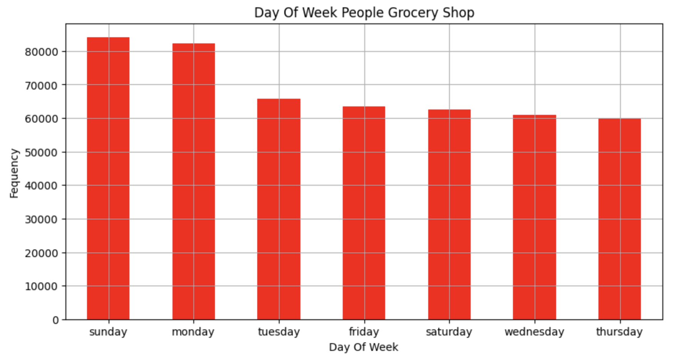
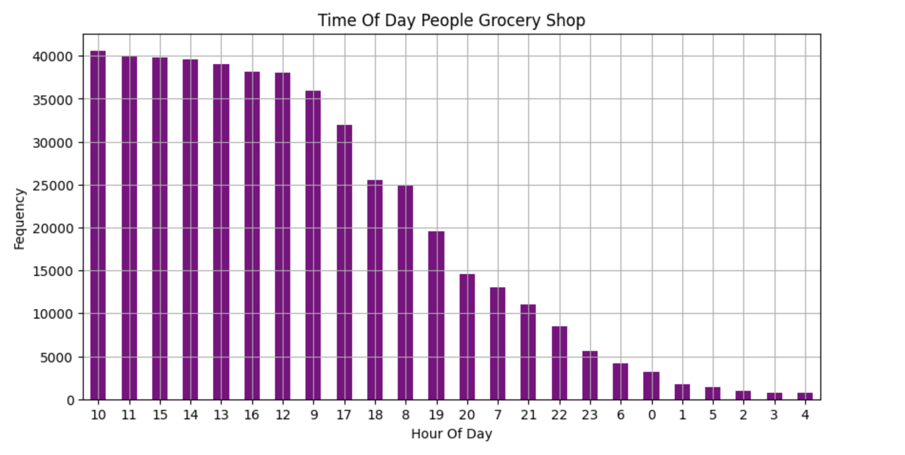
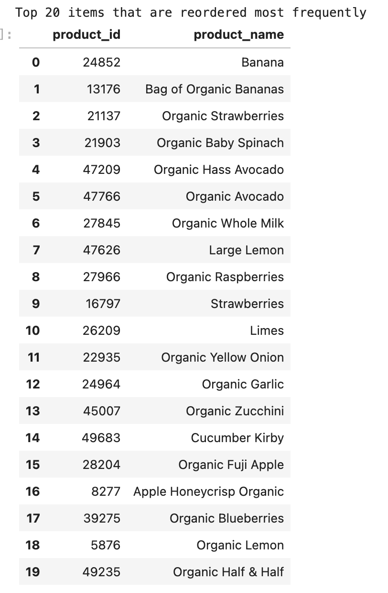
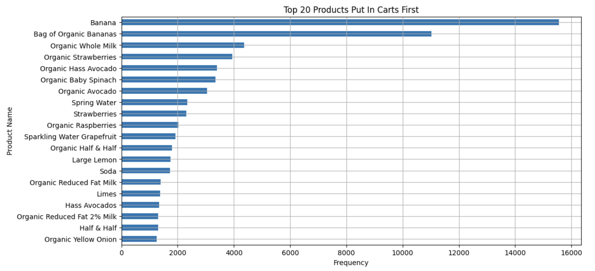

# Instacart Orders Analysis In Python  
By James Weaver

## Introduction  
This project investigates shopping trends on Instacart focusing on customer behavior, order patterns, and product popularity. Leveraging Python's pandas, matplotlib, and numpy libraries, the analysis provides insights into grocery ordering patterns, including reorder frequencies, popular products, and shopping habits by time and day.

## Files  
1. **instacart_analysis.ipynb**  
   The main Jupyter Notebook with detailed code for data preprocessing, analysis, and visualizations.  
2. **instacart_orders.csv**  
   Contains information about each Instacart order, including order times and frequencies.  
3. **products.csv**  
   Metadata about Instacart products, including names, categories, and IDs.  
4. **README.md**  
   Project overview, methodology, and key findings.

## Analysis  
- Examined customer ordering behavior by time and day of the week.  
- Identified top reordered products and the most frequent first items in carts.  
- Analyzed the distribution of items per order and customer ordering frequencies.  
- Visualized trends in product popularity and reorder proportions.

## Key Findings  
- Most orders are placed between 9 AM and 5 PM, with peak shopping hours varying slightly by day.  
- The most popular first cart item was "Bananas," appearing frequently across all users.  
- Customers tend to wait an average of 11 days before placing another order.  
- The majority of orders contained fewer than 13 items, showing a skew towards smaller purchases.  

## Visuals  
### Time of Day and Day of Week Shopping Trends  
 
 

### Top 20 Reordered Products  

  

## Tools Used  
- **Python**: Data analysis and manipulation.  
- **Pandas**: Data cleaning and preprocessing.  
- **Matplotlib**: Visualization of shopping patterns and trends.  
- **NumPy**: Statistical and numerical computations.  

## Future Improvements  
- Explore shopping behavior segmented by customer demographics.  
- Identify patterns in product pairings within single orders.  
- Compare Instacart order patterns with other grocery delivery services.  
